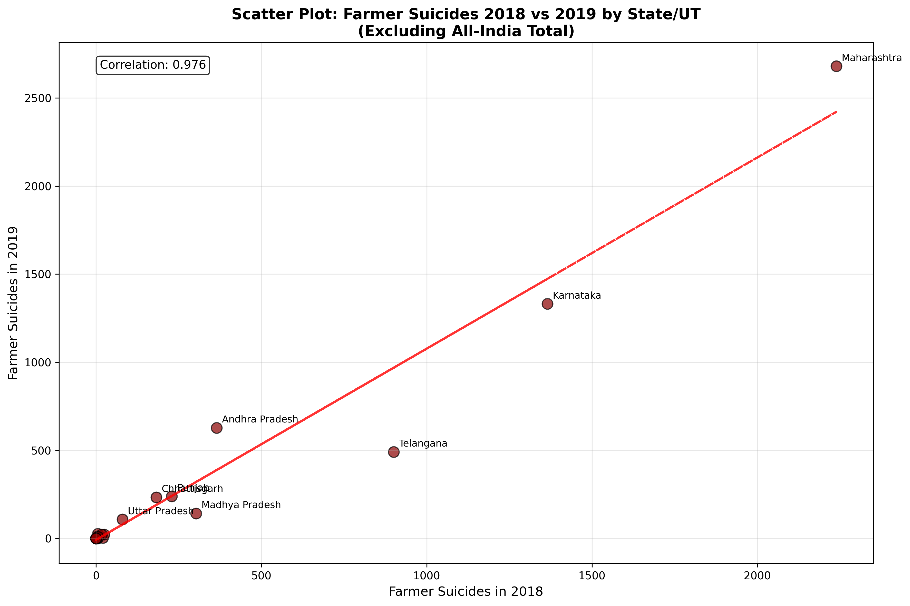
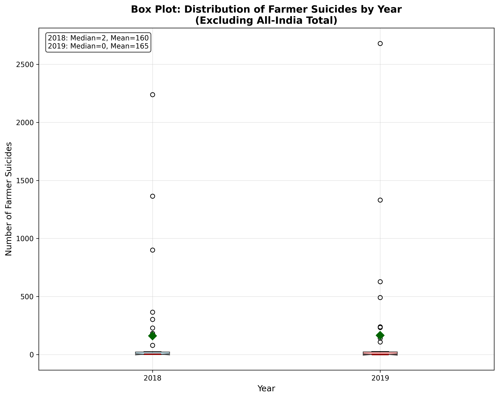
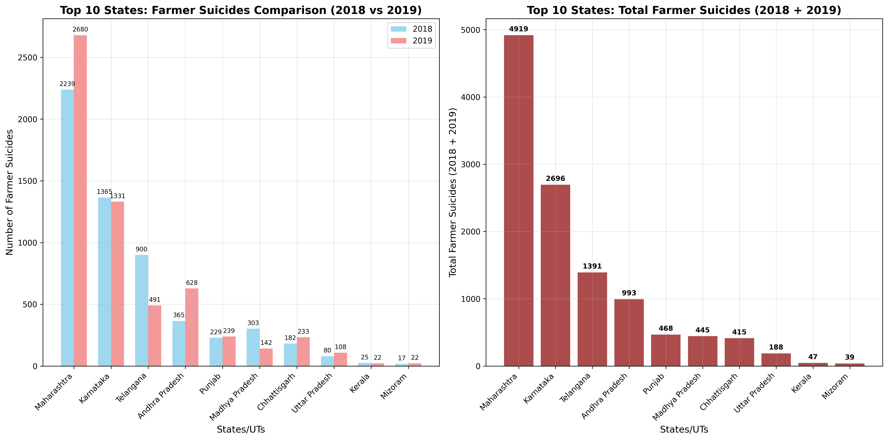

# DS200 Assignment: Analysis of Farmer Suicides in India (2018-2019)

## Project Overview

This project analyzes the **State/UT-wise Suicide Committed by Farmers** data from the National Crime Records Bureau (NCRB) Report for 2018 and 2019. The analysis includes data exploration, visualization, and statistical insights using Python and matplotlib.

## Data Source

- **Dataset**: State/UT-wise Suicide Committed by Farmers, as per NCRB Report during 2018 and 2019
- **Source URL**: https://www.data.gov.in/resource/stateut-wise-suicide-committed-farmers-ncrb-report-during-2018-and-2019
- **File**: RS_Session_254_AU_496_1.csv
- **Organization**: National Crime Records Bureau (NCRB), Government of India
- **Coverage**: All States and Union Territories of India
- **Time Period**: 2018-2019

## Files in Repository

- `plot_function.ipynb` - Main Jupyter notebook containing the analysis and visualizations
- `RS_Session_254_AU_496_1.csv` - Raw dataset
- `README.md` - This documentation file
- `requirements.txt` - Python package dependencies
- `images/` - Directory containing high-resolution plot images
  - `scatter_plot.png` - Correlation analysis between 2018 and 2019 data
  - `box_plot.png` - Distribution analysis showing variability across states
  - `bar_plot.png` - Top 10 states comparison and total suicide counts

## Analysis Summary

### Dataset Characteristics
- **37 records** representing all Indian states and union territories (including All-India total)
- **4 columns**: Serial Number, State/UT, 2018 data, 2019 data
- **Data Quality**: 1 missing value in 2018 data (handled by imputation)

### Key Statistics
- **Total farmer suicides in 2018**: 5,763
- **Total farmer suicides in 2019**: 5,957
- **Year-over-year increase**: 3.4%
- **States with zero reported cases**: 15 states/UTs in both years

## Visualizations Created

### 1. Scatter Plot: 2018 vs 2019 Comparison



- **Purpose**: Examine correlation between consecutive years
- **Key Finding**: Strong positive correlation (r = 0.976)
- **Insight**: States with high suicide rates in 2018 maintained similar patterns in 2019
- **Analysis**: The scatter plot shows a near-perfect linear relationship between farmer suicides in 2018 and 2019, with Maharashtra and Karnataka as clear outliers. The strong correlation indicates systemic factors rather than random variation.

### 2. Box Plot: Distribution Analysis



- **Purpose**: Show variability and distribution across states
- **Key Finding**: High variability with most states having low numbers but few extreme outliers
- **Statistics**: 
  - 2018: Mean = 160.1, Median = 2.0
  - 2019: Mean = 165.5, Median = 0.0
- **Analysis**: The box plot reveals extreme right-skewed distributions for both years, with the majority of states reporting very low suicide numbers (median near 0) while a few states show exceptionally high values. The outliers (Maharashtra, Karnataka, Telangana) dominate the statistics.

### 3. Bar Plot: Top 10 Affected States



- **Purpose**: Identify most affected regions and compare year-over-year changes
- **Key Finding**: Maharashtra and Karnataka are disproportionately affected
- **Analysis**: The dual bar chart clearly shows Maharashtra's dominant position in both years, with a concerning increase from 2018 to 2019. Karnataka maintains high but stable numbers, while Telangana shows a significant decrease, potentially indicating successful policy interventions.

## Top 5 Most Affected States (2018 + 2019 Combined)

1. **Maharashtra**: 4,919 total cases (2,239 in 2018, 2,680 in 2019)
2. **Karnataka**: 2,696 total cases (1,365 in 2018, 1,331 in 2019)  
3. **Telangana**: 1,391 total cases (900 in 2018, 491 in 2019)
4. **Andhra Pradesh**: 993 total cases (365 in 2018, 628 in 2019)
5. **Punjab**: 468 total cases (229 in 2018, 239 in 2019)

## Key Observations

### Statistical Insights
- **Strong temporal consistency**: High correlation indicates systemic rather than random patterns
- **Regional concentration**: Top 5 states account for ~85% of all farmer suicides
- **Slight overall increase**: National trend shows 3.4% increase from 2018 to 2019

### State-wise Trends
- **Maharashtra**: Highest absolute numbers with increasing trend (+19.7%)
- **Karnataka**: Second highest but relatively stable (-2.5%)
- **Telangana**: Significant decrease (-45.4%) - potential policy success
- **Andhra Pradesh**: Substantial increase (+72.1%)

## Technical Implementation

### System Requirements
- **Python**: 3.7 or higher
- **Operating System**: Windows, macOS, or Linux
- **Memory**: Minimum 4GB RAM (8GB recommended)
- **Storage**: ~50MB for data and dependencies

### Core Libraries Used
- **pandas (>=1.3.0)**: Data manipulation and analysis
- **matplotlib (>=3.4.0)**: Data visualization and plotting
- **numpy (>=1.21.0)**: Numerical computations and array operations

### Analysis Methodology
1. **Data Cleaning**: Handled missing values, type conversions
2. **Exploratory Data Analysis**: Statistical summaries, data quality checks
3. **Visualization**: Created three distinct plot types as required
4. **Statistical Analysis**: Correlation analysis, descriptive statistics

## Implications and Recommendations

### Policy Implications
- **Targeted interventions** needed in Maharashtra and Karnataka
- **Study successful models** from states with decreasing trends (e.g., Telangana)
- **Address regional disparities** in agricultural support systems

### Data Quality Considerations
- Some states consistently report zero cases - may indicate under-reporting
- Need for standardized data collection across states
- Importance of multi-year trend analysis

## Academic Context

This analysis was conducted as part of **DS 200 Research Methods** coursework, demonstrating:
- Data acquisition from government sources
- Statistical analysis techniques
- Data visualization best practices
- Research documentation standards

## Repository Information

- **Repository**: DS200-gov-data
- **Author**: Sandeep Kumar
- **Institution**: Indian Institute of Science
- **Date**: October 2025

## How to Reproduce Analysis

### Prerequisites
- Python 3.7 or higher
- pip (Python package installer)

### Installation and Setup

1. **Clone this repository**
   ```bash
   git clone https://github.com/sandeepk9675/DS200-gov-data.git
   cd DS200-gov-data
   ```

2. **Install required packages**
   ```bash
   pip install -r requirements.txt
   ```
   
   Or install packages individually:
   ```bash
   pip install pandas numpy matplotlib jupyter notebook
   ```

3. **Launch Jupyter Notebook**
   ```bash
   jupyter notebook
   ```

4. **Open and run the analysis**
   - Open `plot_function.ipynb` in Jupyter Notebook/JupyterLab
   - Run all cells sequentially from top to bottom

## Citation

If using this analysis, please cite:
```
Kumar, S. (2025). Analysis of Farmer Suicides in India (2018-2019). 
DS 200 Research Methods Assignment. Indian Institute of Science.
Data source: National Crime Records Bureau, Government of India.
```

---

*This project is for academic purposes as part of DS 200 Research Methods course.*